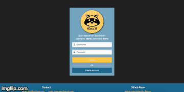

# Recca

Experience Recca at: [www.recca.social](https://www.recca.social)

Welcome to Recca! Our app is centered around the one thing we all love: entertainment. With so much of it available to consume, it can be difficult to organize and keep track of what you want to experience next. With Recca, users can search, save, track, and recommend their favorite movies, shows, books, music, and video games!

When a user searches for the media of their choice, they may Save or Recommend any of the results that are displayed. Saving will store it in the user’s list, where additional options are presented. Once saved, you can Recommend, set to Active, Complete, or Remove the item from your list. The sidebar will update automatically with any media that is set Active or Complete.

But what else do we love about entertainment? Telling our friends about it! Recca allows users to send and receive friend requests, and use the Recommend feature to tell all your friends what you love about whatever you’re experiencing. Recca's homepage displays a feed of all your friends' recommendations. Now, instead of telling them "Yeah, I'll check that out...", and forgetting about it &mdash; you can save it directly from the Feed and always remember it's on your list!

Recca is the perfect place to organize all your media, and the social functionality makes it ideal for talking about all your favorites with your friends!

Sign up, tell your friends, and enjoy Recca!

## Technical details

Recca was built with the MERN stack using [create-react-app](https://github.com/facebook/create-react-app). [Passport](http://www.passportjs.org/) was used in conjunction with bcrypt salt based encryption to handle user authentication and store session information. We use [Bootstrap](https://getbootstrap.com/) to handle higher level layout, and [Sass](https://www.npmjs.com/package/sass) to simplify and speed up the authoring of our stylesheets. Our four external API’s include [OMDB](http://www.omdbapi.com/) for movies and shows, [Google Books](https://developers.google.com/books/), [Spotify](https://developer.spotify.com/documentation/web-api/) for music, and [IDGB](https://igdb.github.io/api/) for games. Each API is queried using [axios](https://www.npmjs.com/package/axios) and the response is parsed to fit our media data model in preparation for storage in the database. The data is displayed to the user through React, where they can track and recommend media to their friends. Each media type is categorized on its own page, which are navigated with [react-router](https://github.com/ReactTraining/react-router). When the user saves a media item, the data is stored using [MongoDB](https://www.mongodb.com/), with the help of [Mongoose](https://mongoosejs.com/). Each user model is associated with their posts, friends, and media in order to store and serve up data to display every feature Recca provides.

**Technologies:**
* MongoDB
* Express
* React
* Node
* JavaScript
* Sass
* APIs ([OMDB](http://www.omdbapi.com/), [IDGB](https://igdb.github.io/api/), [Spotify](https://developer.spotify.com/documentation/web-api/), [Google Books](https://developers.google.com/books/))

**How to Install and Run Locally:**

* Make sure you have [Node](https://nodejs.org/en/download/) and [MongoDB](https://docs.mongodb.com/manual/installation/) installed on your system
* `git clone https://github.com/recca-social/Recca.git`
* `cd Recca` - Change directories to the root
* `npm install`
* `cp .env-example .env` - fill in your .env file with the appropriate API keys, or contact us to request access to ours
* Run `mongod` in a separate terminal window to allow Recca to create your local DB
* `npm start`
* At the Login page, click Create Account
* Sign up and start exploring Recca!

---

Designed, built, and maintained by:

* [Eric Keyes](https://github.com/Ekeyes8500)
* [Cadin McQueen](https://github.com/Awfulnaut)
* [Harry B Young](https://github.com/HarryBY1149)
* [Brian Fitzgerald](https://github.com/brijamfitz)

Contact us at [admin@recca.social](admin@recca.social)

Copyright &#169; 2019